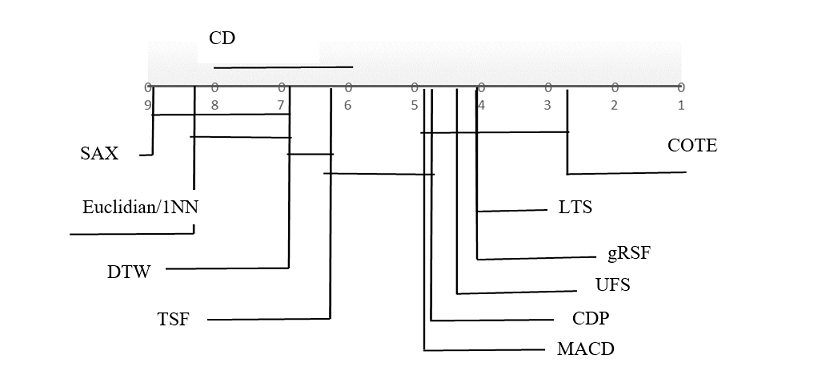

## Python implementation of Concatenation Decision Paths (CDP)- fast and accurate method for time series classification 

### Overview 
Python implementation of the CDP algorithm posses following advantages: 
- **very fast** to (re)train (training time vary from seconds to minutes for datasets from [UCR](https://www.cs.ucr.edu/~eamonn/time_series_data_2018/))
- produces **compact (~KB) models**, in comparison with large standard models (~100MB)  
- maintains **high accuracy** and is comparable or in some cases even more accurate than state of the arts algorithms (Fig.1) 
- python implementation does not depend on other machine learning package. It has only dependencies on standard python packages
- **very simple** to maintain (consists of 8 python files, spread in two folders)

### Installation 
TODO: 

### Training 

<pre>
from core.cdp import CDP
from utils.utils import from_ucr_format, to_ucr_format

# Obtain train dataset from UCR format file
train_dataset = from_ucr(filepath=<'train file path'>, delimiter=<'delimiter'>)

# Initialize CDP
cdp = CDP(dataset=train_dataset
          , model_folder=<'model folder path'>
          , num_classes_per_tree=2
          , pattern_length=100
          , compression_factor=1
          , derivative=False
          , normalize=False)

cdp.fit()

# The result will be model file (.pickle), along with decision patterns file (.csv) produced in 
given model folder. 
</pre>

### Testing 

<pre>
# Initialize CDP
cdp = CDP(dataset=None
          , model_folder=<'model folder path'>
          , num_classes_per_tree=2
          , pattern_length=100
          , compression_factor=1
          , derivative=False
          , normalize=False)

# Get already trained model 
cdp.load_model()

# Obtain test dataset from UCR format file 
test_dataset = from_ucr(<'test file path'>, delimiter=',')

# Predict class indexes of a test dataset
predicted_class_indexes = cdp.predict(test_dataset)

# Iterate through predicted indexes and check correspondence with the original
num_correct_predictions = 0
for i, row in test_dataset.iterrows():
    if row['class_index'] == predicted_class_indexes[i]:
        num_correct_predictions += 1

print(f"Accuracy: {100 * round(num_correct_predictions / len(predicted_class_indexes), 2)}%")

</pre>

### Performance - accuracy and training time 
 
CDP model has very smalltraining time - it vary from seconds to minutes for dataset from USR database. 
Table below shows some elapsed training time and corresponding accuracy along with used hyper-parameters. 
Also. Fig. 1 shows comparison of the CDP method in terms of accuracy with some state-of-the-art time series 
classification method. Note: Accuracies reported for Fig.1 were obtained by C# implementation of CDP method. 
Table 1 contain training time and accuracies obtained by python implementation of the CDP method. Python implementation
does not uses any acceleration techniques as numba, or multiprocessing, although the code is easy to change and
accommodate these techniques. 

Table 1. Training time and accuracy of **python implementation** of CDP method

| UCR Dataset  | Num. classes | Num. train samples | Num. test samples | Training time, [sec] | Accuracy, [%] | Compression rate | Num. decision trees | Normalize | Derivative |
|--------------|--------------|--------------------|-------------------|----------------------|---------------|------------------|---------------------|-----------|------------|
| Swedish Leaf | 15           | 500                | 625               | 455                  | 87.2%         | 2                | 500                 | No        | No         |
| Beef         | 5            | 30                 | 30                | 556                  | 70.1%         | 1                | 200                 | Yes       | Yes        |
| OliveOil     | 4            | 30                 | 30                | 320                  | 73.2%         | 2                | 200                 | Yes       | No         |
| Symbols      | 6            | 25                 | 995               | 1273                 | 69.3%         | 4                | 600                 | Yes       | Yes        |
| OsuLeaf      | 6            | 200                | 242               | 1346                 | 95.1%         | 4                | 800                 | Yes       | Yes        |

There is also an implementation of CDP algorithm in C#, which on the same CPU produced even better results (Table 2)

Table 2. Training time and accuracy of **C# implementation** of CDP method

| UCR Dataset  | Num. classes | Num. train samples | Num. test samples | Training time, [sec] | Accuracy, [%] | Compression rate | Num. decision trees | Normalize | Derivative |
|--------------|--------------|--------------------|-------------------|----------------------|---------------|------------------|---------------------|-----------|------------|
| Swedish Leaf | 15           | 500                | 625               | 16.3                 | 92.7%         | 2                | 700                 | No        | No         |
| Beef         | 5            | 30                 | 30                | 24.1                 | 86.8%         | 1                | 400                 | Yes       | Yes        |
| OliveOil     | 4            | 30                 | 30                | 71.3                 | 90.1%         | 2                | 200                 | Yes       | No         |
| Symbols      | 6            | 25                 | 995               | 3.8                  | 95.6%         | 4                | 600                 | Yes       | Yes        |
| OsuLeaf      | 6            | 200                | 242               | 15.1                 | 88.9%         | 4                | 800                 | Yes       | Yes        |

We tested several methods for time series classification on 40 datasets from UCR database. CDP methods stays well in terms 
of accuracy as shown on figure below. 

Fig. 1 Comparison of state-of-the-art classifiers and CDP method. Used **C# implementation** of 
CDP method.    

### Model
Two files are produced during training process. First one contains representation in .pickle format
of decision tree sequence, and the second one (in csv format), contains concatenated decision patterns produced from decision
trees, for each time series from train dataset, as shown in the example below. 

<pre>
class_index,class_pattern
1,LLRLRLLRRLLLRLLLLRL...
1,LLLLRRRRLLLLLLRRRRR...
2,LLLLRRRRLLLLLLLLLLL...
</pre>

These files are stored in model folder given as an input parameter to the process. They have hardcoded names
(defined in cdp.py) as follows: 
<pre>
# Filename of trained model - contains sequence of decision trees
MODEL_FILENAME = 'cdp_model.pickle'
# Filename of csv file that contains predicted class indexes
PATTERNS_FILE_NAME = 'patterns.csv'
</pre>

### Classification
Currently, classification is done by producing decision pattern of an incoming time series, and comparing 
that pattern to such patterns from train dataset. The pattern from train dataset, which mostly resemble the 
incoming time series pattern will define its index. 

Default process of classification is a bit slow as the incoming time series pattern has to be compared 
with many patterns, which is a bit slow process. 

More advanced classification methods such as Neural Networks, Random Forests or other could be applied
for even more precise and fast classification, by taking produced decision patterns as input features
to these methods. 

### Contacts: 
cdp_project@outlook.com

### References: 

_“Concatenated Decision Paths Classification for Datasets with Small Number of Class Labels”, Ivan Mitzev and N.H. Younan, ICPRAM, Porto, Portugal, 24-26 February 2017_

_“Concatenated Decision Paths Classification for Time Series Shapelets”, Ivan Mitzev and N.H. Younan, International journal for Instrumentation and Control Systems (IJICS), Vol. 6, No. 1, January 2016_

_“Combined Classifiers for Time Series Shapelets”, Ivan Mitzev and N.H. Younan, CS & IT-CSCP 2016 pp. 173–182, Zurich, Switzerland, January 2016_

_“Time Series Shapelets: Training Time Improvement Based on Particle Swarm Optimization”, Ivan Mitzev and N.H. Younan, IJMLC 2015 Vol. 5(4): 283-287 ISSN: 2010-3700_

